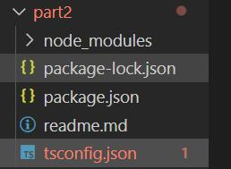
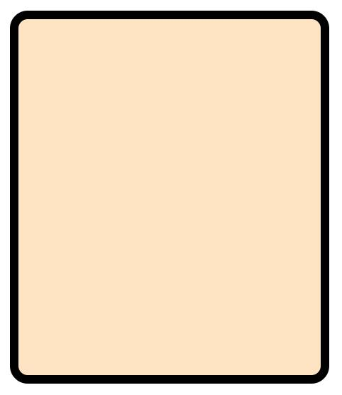
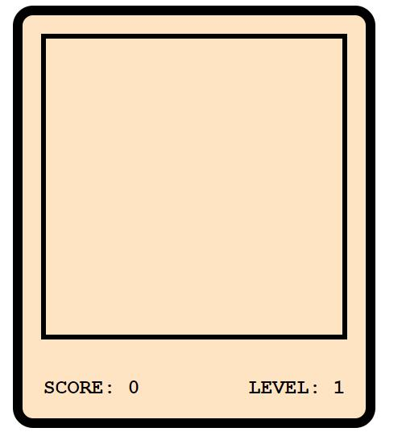
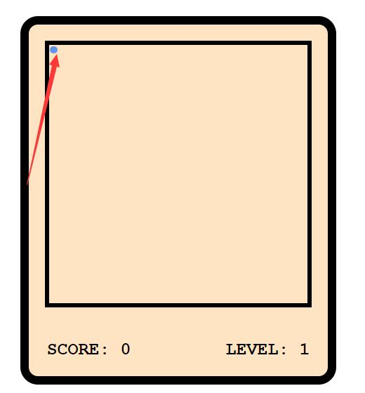
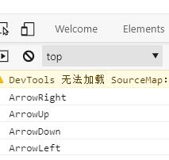
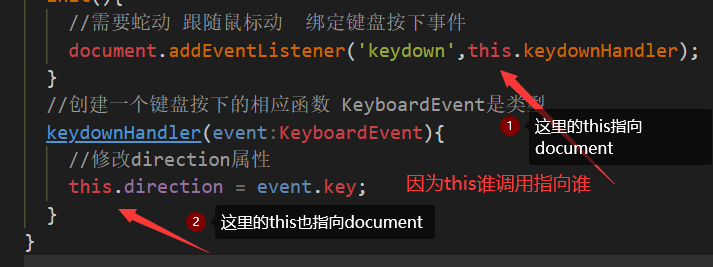

## 基于ts的贪吃蛇游戏

### 1. 首先是项目坏境的搭建
* 1. 可以参考地址 https://juejin.cn/editor/drafts/6961039407012904997
* 2. 首先是新建一个文件夹part2(名字自己取类不要带中文)需要全局安装typesript的 `npm i -g typescript` 
* 3. `tsc --init` 生成`tsconfig.json`文件并且进行相应配置,我这里就是更改了下面内容，指定使用ES6语法,ES6模块

```javascript
"target": "ES2015",
"module": "ES2015",
```

* 4. 配置webpack打包坏境 初始化项目——`npm init -y`生成`package.json`文件。
* 5. 下载一些webpack打包需要的插件  `npm i -D webpack webpack-cli typescript ts-loader`,并且新建一个`webpack.config.js`文件进行对应配置,配置之前先新建一个`src dist`文件夹
<p>
  
</p>

- 配置`webpack.config.js`文件详细过程见`webpack.config.js`文件有详细注释
`webpack.config.js`基本配置如下：
```javascript
//引入一个包
const path = require('path');
module.exports = {
    //配置入口文件
    entry: "./src/index.ts",
    //配置打包后的文件位置
    output: {
        path: path.resolve(__dirname, 'dist'),
        filename: "bundle.js",
        environment: {
            arrowFunction: false,
        }
    },
    //配置webpack打包时使用的模块
    module: {
        rules: [{
            //test 指定规则生效文件所有后缀为.ts的文件
            test: /\.ts$/,
            //使用ts-loader处理 .ts文件
            use: 'ts-loader',
            //要排除的文件
            exclude: /node_modules/,
        }]
    }
}
```

- 配置完之后在`package-json`文件里面写入
```javascript
"scripts": {
        ...
        "build": "webpack"
    },
```
- 之后在当前目录下执行`npm run build`测试`webpack`基本配置是否生效,出现如下：即成功
<p>
  
</p>

- 继续配置`webpack.config.js`,下载`npm i -D html-webpack-plugin`插件自动生成html文件并在`webpack.config.js`里面配置
```javascript
//引入插件
const HTMLWebpackPlugin = require('html-webpack-plugin');
...
//配置Webpack插件
plugins: [
        new HTMLWebpackPlugin(),
    ]
```
- 当前目录下执行`npm run build`测试插件是否配置成功;配置成功则会在dist目录下面生成index.html文件,也可以自己提供index.html模板：
```javascript
  plugins: [
    new HTMLWebpackPlugin({
      template: './src/index.html'
    }),
  ]
```
配置自动构建 `npm i -D webpack-dev-server`,并且在package.json文件中配置：
```javascript
   "scripts": {
        ...
        "start": "webpack serve --open"
    },
```
- 配置完成之后在当前目录下面执行`npm start`,打开网页的控制台如果有错误刷新一下;
- 继续配置每次更新前删除旧的dist文件：配置方式和`npm i -D html-webpack-plugin`一样不在赘述;参照文件引入吧
- 设置引用模块
```javascript
resolve: {
        extensions: ['.ts', '.js']
    }
```
- 配置babel解决兼容性 `npm i -D @babel/core @babel/preset-env babel-loader core-js`
配置`webpack.config.js`文件
```javascript
use: [
                // 'babel-loader',
                {
                    loader: "babel-loader",
                    //设置babel 预定义的坏境在哪些浏览器运行
                    options: {
                        presets: [
                            [
                                //指定坏境插件
                                "@babel/preset-env",
                                //配置信息
                                {
                                    //targets指定兼容的浏览器版本 corejs指定corejs版本
                                    targets: {
                                        "chrome": "58",
                                        "ie": "11",
                                    },
                                    //
                                    "corejs": "3",
                                    "useBuiltIns": "usage"
                                }
                            ]
                        ]
                    }
                },
                ...
            ],
```
> 完了之后把代码上传到gitHub仓库,注意不要上传那行node_modules dist下面的文件。
- 继续配置 安装一些样式处理插件 `npm i -D less less-loader css-loader style-loader`
在`webpack.config.js`里面配置：
```javascript
rules: [
          ....
            //设置Less文件的处理
            {
                test: /\.less$/,
                use: [
                    //按顺序执行的
                    "style-loader",
                    "css-loader",
                    "less-loader"
                ]
            }
        ]
```
- 在src下面新建文件夹style->index.less,并写入测试代码,然后需要在index.ts里面引入文件` import './style/index.less' `
```javascript
body {
  background-color: aqua;
}
```
- 引入less之后,需要引入和babel类似的插件, 兼容浏览器,安装插件`npm i -D postcss postcss-loader postcss-preset-env`,同样的需要
在`webpack.config.js`文件里面配置
```javascript
use: [
                    //按顺序执行的
                    "style-loader",
                    "css-loader",
                    //引入postcss
                    {
                        loader: "postcss-loader",
                        options: {
                            postcssOptions: {
                                plugins: [
                                    [
                                        "postcss-preset-env",
                                        {
                                            browers: "last 2 versions"
                                        }
                                    ]
                                ]
                            }
                        }
                    },
                    "less-loader"
                ]
```
重新编译看是否成功.

### 2. 项目开始
#### 1. 搭建静态页面
- 1. 创建游戏主容器 写对应样式,效果图如下：首先当前目录下npm start实现自动更新
<div>
    
</div>

- 2. 设置游戏的舞台
- 3. 设置游戏积分牌 效果图如下：
<div>
  
</div>

- 4. 设置蛇的样式 🐍的效果图
<div>
  
</div>

- 5. 设置食物 食物的效果如下，把🐍也改了一下
<div>
  
</div>

#### 2. TS逻辑代码(行为)
#####  1. 定义食物类
```javascript
class Food {
  //定义一个属性表示食物对应的元素
  element: HTMLElement;
  constructor(){
    // !表示不可能为空  获取页面中的元素并讲其赋值给element
    this.element = document.getElementById('food')!;
  }
  //获取食物坐标x
  get X(){
    return this.element.offsetLeft;
  }
  //获取食物Y坐标
  get Y(){
    return this.element.offsetTop;
  }
}
```

* 2. 食物类还需要一个方法随机改变食物位置 change
食物坐标有范围: 食物最小位置为0 最大位置为290 🐍一次移动一个10px
```javascript
//修改食物位置的方法 随机
  //食物最小位置为0 最大位置为290 🐍一次移动一个10px
  change(){
   let top = Math.round(Math.random()*29)*10;
   let left = Math.round(Math.random()*29)*10;
    this.element.style.left = top + 'px';
    this.element.style.top = left + 'px';
  }
```
##### 2. 记分牌逻辑
等级由达到多少分来控制，比如达到20分就增加一个等级，但是最高等级有限制:
```javascript
class ScorePanel {
  score = 0;
  level = 1;
  scoreEle: HTMLElement;
  levelEle: HTMLElement;
  //设置变量限制等级
  maxLevel: number;
  //设置达到分数升级
  upScore: number;
  constructor(maxLevel: number=10,upScore: number = 10){
    this.maxLevel = maxLevel;
    this.upScore = upScore;
    this.scoreEle = document.getElementById('score')!;
    this.levelEle = document.getElementById('level')!;
  }
  //方法  加分方法
  addScore(){
   this.scoreEle.innerHTML = ++this.score + '';
   //表示每20分升级
   if(this.score % this.upScore === 0){
     this.levelUp();
   }
  }
  //提升等级 升级应该由分数达到多少控制
  levelUp(){
    if(this.level<this.maxLevel){
    this.levelEle.innerHTML = ++this.level + '';
    }
  }
}
```
最后 一个类放在一个ts文件里面

##### 3. 蛇的类
1. 需要获取蛇头 蛇身  以及蛇的容器，后序增加蛇的身体长度；
```javascript
class Snake {
  //表示蛇头的元素
  head: HTMLElement;
  //蛇的身体
  bodies: HTMLCollection;
  // 获取蛇的容器 因为后序需要增加蛇的身体
  element: HTMLElement;
  constructor(){
    this.element = document.getElementById('snake')!;
    this.head = document.querySelector('#snake>div') as HTMLElement;
    this.bodies = document.getElementById('snake')!.getElementsByClassName('snake-body');
  }
}
```
2. 获取蛇头坐标，设置蛇头坐标
```javascript
//获取蛇头坐标
  get X(){
    return this.head.offsetLeft;
  }
  get Y(){
    return this.head.offsetTop;
  }
  //设置蛇头坐标
  set X(value: number){
    this.head.style.left = value + 'px';
  }
  set Y(value: number){
    this.head.style.left = value + 'px';
  }
```
3. 蛇吃到食物变长
使用`insertAdjacentHTML`插入蛇身片段 https://developer.mozilla.org/zh-CN/docs/Web/API/Element/insertAdjacentHTML
```javascript
//蛇吃到食物变长
  addBody(){
    //向element中添加一个div
    const snakeHTML = `
    <div class="snake-body">
    <div></div>
    <div></div>
    <div></div>
    <div></div>
    </div>
    `
    this.element.insertAdjacentHTML("beforeend",snakeHTML);
  }
```

##### 4. 控制游戏的类GameControl.ts
1. 首先是导入蛇 食物 游戏积分类
```javascript
//游戏控制器 控制其他的所有类
import Snake from './Snake';
import Food from './Food';
import ScorePanel from './ScorePanel';

//游戏控制器，控制其他的所有类
class GameControl{
  //定义三个属性
  snake:Snake;
  food: Food;
  scorePanel: ScorePanel;
  constructor(){
    this.snake = new Snake();
    this.food = new Food();
    this.scorePanel = new ScorePanel();
  }
}

export default GameControl;
```
2. 控制游戏的一些方法
```javascript
init(){
    //需要蛇动 跟随鼠标动  绑定键盘按下事件
    document.addEventListener('keydown',this.keydownHandler);
  }
  //创建一个键盘按下的相应函数 KeyboardEvent是类型
  keydownHandler(event:KeyboardEvent){
    console.log(event.key);
  }
```
测试结果：
<div>
  
</div>
但是在ie里面和上面结果不一样 是 Up Down Left Right

3. 处理按键 需要用一个变量存储按键动作
```javascript
class GameControl{
  ...
  direction: string;
  constructor(){
    ...
    this.direction = '';
    ...
  }
}
```
键盘处理事件里面的this指向问题,this指向document,所以使用`bind`改变this指向
<div>
  
</div>

4. 蛇移动处理方法 snakeRun
```javascript
snakeRun(){
    /* 
    * 使用this.direction改变蛇位置 
    * 向上 top 减少
    * 向下 top 增加
    * 向左 left 减少
    * 向右 left 增加
    */
  //  获取蛇原来的坐标
  let X = this.snake.X;
  let Y = this.snake.Y;
  // console.log(this.direction);
  //这里考虑兼容ie 所以有8种情况
    switch(this.direction){
      case "ArrowUp":
      case "Up":Y-=10;
        break;
      case "ArrowDown":
      case "Down":Y+=10;
        break;
      case "ArrowLeft":X-=10;
      case "Left":
        break;
      case "ArrowRight":X+=10;
      case "Right":
        break;
      default:break;
    }
    //修改蛇位置X  Y
    this.snake.X = X;
    this.snake.Y = Y;
    //开启定时器让蛇能自己移动
    setTimeout(this.snakeRun.bind(this),300-(this.scorePanel.level-1)*30);
  }
```
蛇需要判断是否出界 这里把这个判断放到蛇类里面去
```javascript
set Y(value: number){
    if(this.Y===value){
      return ;
    }
    if(value<0||value>290){
      throw new Error('蛇撞墙了！！！')
    }
    this.head.style.top = value + 'px';
  }
set X(value: number){
  ...
}
// 在控制游戏类GameControl.ts里面设置,因为在Snake类里面如果超过X Y范围就抛出了一个错误,所以这里使用try catch捕获
try{
      this.snake.X = X;
      this.snake.Y = Y;
    }catch(e){
      alert(e.message);
      //isLive设置为false
      this.isLive = false;
    }
```
5. 检测蛇是否吃到食物
```javascript
//定义一个方法，检查蛇是否吃到食物
  checkEat(X:number,Y:number){
   if(X===this.food.X&&Y===this.food.Y){
      //食物位置更新
    this.food.change();
    //分数也增加
    this.scorePanel.addScore();
    this.snake.addBody();
   }
  }
```
##### 5. 🐍身体移动
蛇的身体要从后往前移动 

比如：
- 第四节的位置 = 第三节的位置
- 第三节的位置 = 第二节位置 
- 都往前走一步
移动身体代码
```javascript
// 添加蛇身体移动方法
  moveBody(){
    //遍历所有身体
    for(let i=this.bodies.length-1;i>0;i--){
      // 获取前一位身体的位置
      let X = (this.bodies[i-1] as HTMLElement).offsetLeft;
      let Y = (this.bodies[i-1] as HTMLElement).offsetTop;
      //将值设置到当前的节点身上
      (this.bodies[i] as HTMLElement).style.left = X + 'px';
      (this.bodies[i] as HTMLElement).style.top = Y + 'px';
    }
  }
```
然后在 set X  set Y方法里面调用这个方法,但是呢这个蛇现在很高级hhhhh，可以掉头还可以穿过自己身体，所以需要解决这个问题。
```javascript
//修改X 的时候是修改水平坐标 向左移动就不能向右掉头
    if(this.bodies[1]&&(this.bodies[1] as HTMLElement).offsetLeft === value){
      // console.log('水平方向掉头了');
      // 如果发生掉头 让蛇向反方向继续移动 
      if(value>this.X){
        //新的值大于value 证明蛇想向右走 所以我们不让她掉头继续想左
        value = this.X -10;
      }else {
        value = this.X + 10;
      }
    }
```
再解决🐍能穿过自己身体的问题
```javascript
//检查头是否撞上身体
  checkHeadBody(){
    // 获取所有身体
    for(let i=1;i<this.bodies.length;i++){
      let bd = (this.bodies[i] as HTMLElement);
      if(this.X === bd.offsetLeft&&this.Y === bd.offsetTop){
        //进入判断 说明蛇头撞到了身体
        throw new Error('蛇自杀了！！！救命啊')
      }
    }
  }
```
##### 6. 做一些使用优化
1. 原先游戏结束是弹出alert,考虑更美观的方式,如下所示
<div>
  
</div>
